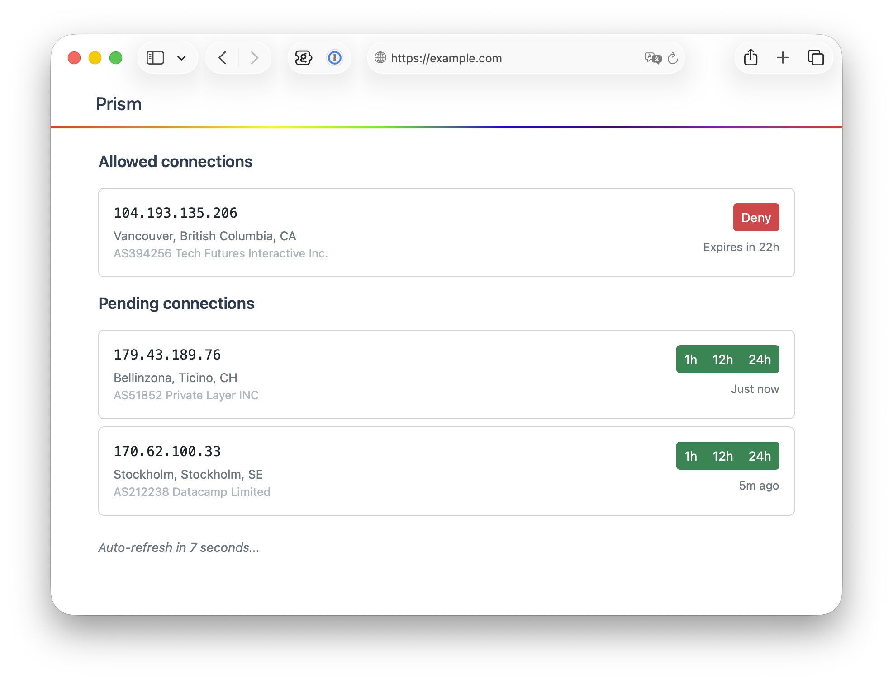
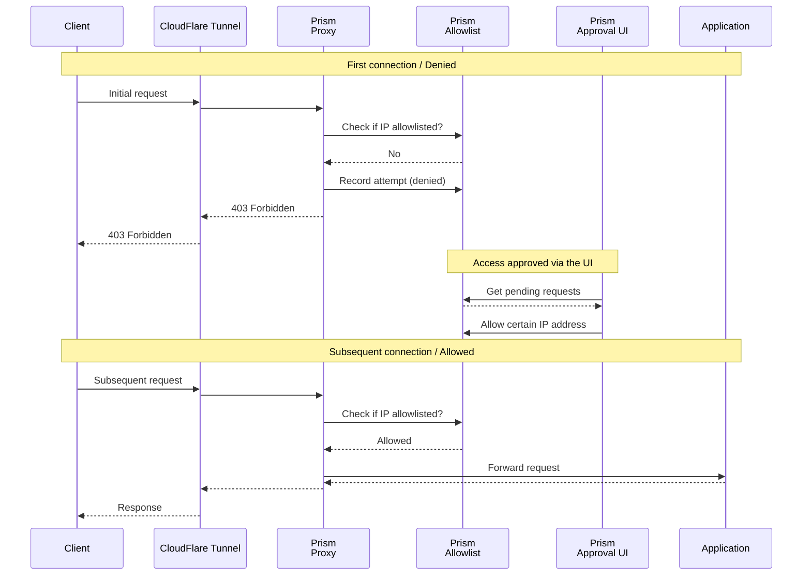

# Prism

HTTP proxy with dynamic access control. Denies all connections by default, but provides a web UI to allow connections from certain IPs.

The reason I created this is that I need to have access to some of my apps from devices which don't support VPN connectivity to my private network. For example, my car runs Android and has a web browser, but I cannot install Tailscale there to access self-hosted apps like Jellyfin to watch movies. I don't expose self-hosted apps to the internet because I don't want to rely too much on any given app's security. This proxy seems like a good compromise.

> [!WARNING]  
> There's an assumption that you are going to have something like CloudFlare Tunnels in front of this proxy. Something that would be a trusted source of caller's IP address. Which would be populated in one of the supported request headers: `CF-Connecting-IP`, `X-Forwarded-For`, `X-Real-IP`.



## Usage

**Check out the _example_ directory.**

### Setup

Here's an example with Docker Compose, which is what I use:

```yaml
services:
  
  prism:
    image: codeberg.org/r1/prism:latest
    environment:
      - TARGET_URL=https://example.com
      - PROXY_PORT=8099
      - ADMIN_PORT=8097

  cloudflared:
    image: cloudflare/cloudflared:latest
    command: tunnel --no-autoupdate run --token YOUR_TOKEN
    depends_on:
      - prism
```

### Configuration

The proxy can be configured via environment variables.

Required:
- `TARGET_URL` - Backend URL (e.g., `http://backend:8080`)

Optional:
- `PROXY_PORT` - Proxy port (default: `8000`)
- `ADMIN_PORT` - Admin port (default: `8080`)

## Process overview


